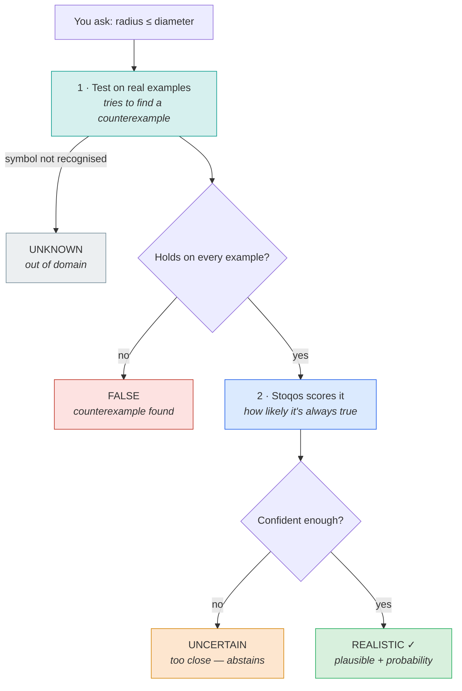

# Stoqos — a calibrated model for the REALISTIC level

MatyOS uses a three-valued logic: **TRUE** (the kernel proved it), **FALSE** (a
counterexample refuted it), and **REALISTIC** (held on the evidence, but unproven).
TRUE and FALSE are decided by proof and by counterexample. Only REALISTIC is
inherently uncertain — and **Stoqos estimates that uncertainty**: given a bound
that survived the evidence, it returns a *calibrated probability that the bound is
actually true*.

Stoqos is a **scorer, never a judge.** It grades the uncertain middle; it can never
promote a claim to TRUE (the kernel's job) or demote it to FALSE (a
counterexample's job). A wrong or offline Stoqos wastes search effort; it can never
make MatyOS assert a falsehood.

## The flow

A claim comes in at the top and leaves as exactly one of four honest verdicts.
Stoqos only *scores* the uncertain middle — the kernel decides real TRUE.



Run the whole flow yourself from the terminal:

The verdict is the paper's three-valued logic — **TRUE / FALSE / REALISTIC** (plus
UNKNOWN when the statement cannot be judged at all):

```console
$ matyos realistic "radius <= diameter"          # a known theorem
verdict:  TRUE        proven — a known theorem (the kernel decides TRUE)

$ matyos realistic "diameter <= radius"
verdict:  FALSE       a counterexample exists in the evidence

$ matyos realistic --domain triangles "tworadius <= circumradius"
verdict:  REALISTIC   holds on all evidence, but unproven
value:    P(true) = 0.60  (calibrated, confidence 0.62)

$ matyos realistic "foo <= bar"
verdict:  UNKNOWN     cannot be judged (out of domain / unparseable)
```

TRUE means the kernel / known-facts database proved it — never the score alone;
REALISTIC is the middle value (held on evidence, unproven), carrying Stoqos's
calibrated probability. The mapping from the typed `Judgement` to these three values
is `stoqos.truth3(j)`.

Judge in another domain with `--domain` — real statements outside graphs become
runnable (Stoqos judges the bound; the kernel still owns TRUE):

```console
$ matyos realistic --domain triangles "tworadius <= circumradius"   # Euler's inequality
verdict:  REALISTIC   held on the strong battery; unproven

$ matyos realistic --domain triangles "longest <= shortest"
verdict:  FALSE       a counterexample exists in the evidence
```

Add `--json` for a machine-readable `Judgement`.

## Using it

```python
from matyos.discovery import stoqos

stoqos.judge("radius <= diameter")
# Judgement(verdict='realistic', value=1.0, confidence=1.0, known=True, ...)

stoqos.judge("diameter <= radius")     # a counterexample exists in the evidence
# Judgement(verdict='false', value=None, ...)

stoqos.judge("foo <= bar")             # out of domain
# Judgement(verdict='unknown', value=None, ...)

# domain-general: score any bound from two aligned evidence value-lists
stoqos.score_evidence(lhs_values, rhs_values)   # -> P(true) in [0,1], or None if it fails

# rank a batch of graph candidates by promise (uses Jev when configured, else Stoqos)
from matyos.discovery import graph
graph.classified_search(score=True)
```

`judge()` returns a typed `Judgement` (verdict **realistic** / **uncertain** /
**false** / **unknown**, plus a `known` flag). `stoqos.truth3(j)` collapses it to the
paper's three-valued logic a user reads — **true** (proven / known theorem),
**false** (counterexample), **realistic** (held on evidence, unproven) — plus
**unknown** when the statement can't be judged.

## How it was built (Phases 0–5)

| Phase | What | Result (held-out, measured) |
|---|---|---|
| 0 | Logistic baseline, 7 hand features | Brier 0.182 |
| 1 | Learned MLP + richer features | Brier **0.141** (−22%) |
| 2 | + invariant metadata (family, monotonicity, known-facts) | fixes known-theorem misses (κ≤δ 0.02→0.85) |
| 3 | Typed API (`judge`) with abstention | realistic/uncertain/false/unknown |
| 4 | Selective prediction | accuracy rises 0.985→0.998 as it abstains |
| 5 | Multi-domain (graphs + number sequences) | one model: graphs 0.886, sequences 0.853 AUC |
| 6 | Five domains + leakage-free benchmark | one model over graphs / sequences / number-theory / means / triangles — see table |

Training labels are **kernel-grounded**: a bound is labelled *true* when it holds on
a hard verification battery and *false* when a counterexample is found. No human
opinion is injected.

## Multi-domain benchmark (leakage-free)

Five domains, each with its own functionals over its own evidence points
(`matyos/discovery/domains.py`): **graphs** (invariants over graphs), **sequences**
(functionals over sequence terms), **number_theory** (arithmetic functions over
integers), **means** (the AM–GM family over positive vectors), and **triangles**
(geometry inequalities over triangle side-triples: perimeter, area, inradius,
circumradius, and Euler's `2r ≤ R`). Reproduce with `stoqos.benchmark()`.

Every number is measured on a **pair-disjoint split** — whole functional pairs are
held out, so the model is tested on bounds it has never seen (no pair-identity
leakage):

| domain | pair-disjoint AUC | one joint model (AUC) |
|---|---|---|
| graphs | 0.84 | 0.81 |
| sequences | 0.99* | 1.00* |
| number_theory | 0.84 | 0.80 |
| means | 0.89 | 0.92 |
| triangles | 0.56 | 0.50 |

*small test set. One model trained jointly on all five covers them all (shipped as
`stoqos_evidence.json`, used by `score_evidence`).

**Triangles is honestly the hard case.** The joint model ranks triangle bounds at
chance (0.50 AUC): the evidence features don't separate true from false geometry
inequalities. So on `triangles`, Stoqos abstains often (Euler's `2r ≤ R` comes back
UNCERTAIN, not committed) — the reliability there comes entirely from the **exact
counterexample test** on the strong battery (a FALSE is a real FALSE), not from the
score. This is the intrinsic ceiling in plain view: adding a domain doesn't grant
ranking power the evidence can't supply.

**Transfer fails across domains.** A model trained on one domain does not transfer
to another and sometimes anti-transfers (below chance). Generality comes only from
**joint** multi-domain training, not transfer — inspect the matrix with
`benchmark()["transfer"]`. Small per-domain test sets make these numbers noisy
run-to-run; treat them as ranges, not decimals.

## Honest limitations

- **Aggregate-calibrated, not an oracle.** Reliability holds in aggregate; a single
  score is not a verdict. Trust the ranking and the calibrated probability, never a
  lone number as truth.
- **Same-domain memorisation.** In-distribution metrics are inflated because train
  and test share the same invariant pairs; the honest numbers are the pair-disjoint
  and cross-domain ones above.
- **No zero-shot transfer.** A model trained on one domain does *not* transfer to
  another (often worse than chance). Generality comes only from **joint
  multi-domain training** (Phase 5), not transfer.
- **Domain-bounded, and not equally strong in each.** Covers graphs, sequences,
  number-theory, means, and triangles — but ranking quality varies sharply (graphs
  and means ~0.85, triangles at chance). Outside these domains the output is
  UNKNOWN; inside a weak one, lean on the counterexample test, not the score.

## Relation to Jev

Jev (TypeSafe AI) is a calibrated decision *model*; REALISTIC is a *logic*. They
share one instinct — never fake certainty, put an honest number on the unknown —
but Stoqos's calibration is grounded in a **kernel** (TRUE means *proven*), which
a purely statistical model is not. `matyos.discovery.jev` will use the Jev API as
the promise-scorer when `MATYOS_JEV_API_KEY` is set, falling back to a transparent
heuristic otherwise.
